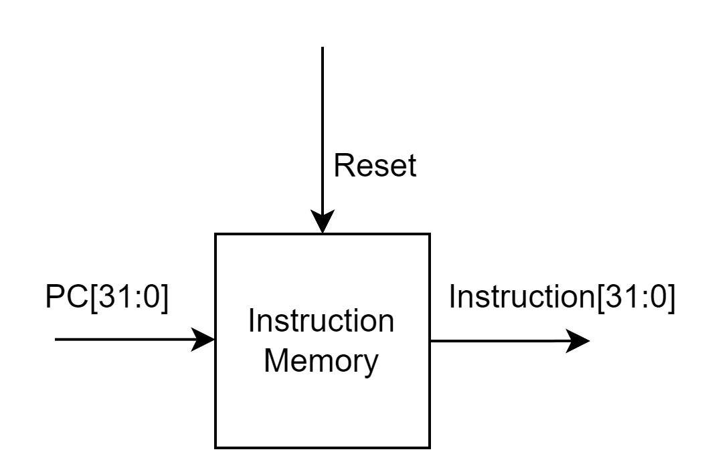

# Basic Component

## Table of Contents
- [Basic Component](#basic-component)
  - [Table of Contents](#table-of-contents)
    - [Discription](#discription)
    - [Instruction Fetch Stage](#instruction-fetch-stage)
      - [Program Counter](#program-counter)
      - [Insruction Memory](#insruction-memory)
      - [PC Add 4](#pc-add-4)
    - [Instruction Decode Stage](#instruction-decode-stage)
      - [Register File](#register-file)
      - [Control Unit](#control-unit)
      - [Sign Extend](#sign-extend)
      - [Shift Left 2 bits](#shift-left-2-bits)
      - [Branch Adder](#branch-adder)
      - [XOR\_NOR](#xor_nor)
    - [Execution Stage](#execution-stage)
      - [Alu Control Unit](#alu-control-unit)
      - [ALU](#alu)
    - [Memory Stage](#memory-stage)
      - [Data Memory](#data-memory)
  - [Rivision history : initial](#rivision-history--initial)

***
### Discription
Basic MIPS Components
### Instruction Fetch Stage
  In this stage, we need to deal with current PC address and next PC address.
#### Program Counter


```
module ProgramCounter (
    input clk, reset, stall,
    input [31:0] pc_in,
    output reg [31:0] pc_out
);
    reg [1:0] cnt = 2'b00; 

    always @(posedge clk or posedge reset) begin
        if (reset) begin
            pc_out <= 32'd0;
            cnt <= 2'b00;
        end
        else if (stall) 
            cnt <= 2'b10;
        else if (cnt > 2'b10) 
            cnt <= cnt - 1'b1;
        else 
            pc_out <= pc_in;
    end
endmodule
```

#### Insruction Memory



```
module inst_mem(  
    input reset, 
    input [31:0] pc,  
    output reg [31:0] instruction  
    );  
    wire [3:0] rom_addr = pc[5:2];  
    reg [31:0] rom[255:0];  // 256 words of 32 bits each
    initial begin  
      rom[0] = 32'b001000_00000_00001_0000000000000001; // addi $1, $0, 1
      rom[1] = 32'b001000_00001_00011_0000000000000011; // addi $3, $1, 3
      rom[2] = 32'b00000000000000000000000000000000; // nop
      rom[3] = 32'b000100_00001_00000_0000000000000100; // beq $s1, $0, 4
      rom[4] = 32'b000100_00001_00001_1111111111111000; // beq $s1, $s1, -8
      rom[5] = 32'b001000_00000_00001_0000000000000001; // addi $1, $0, 1
      rom[6] = 32'b001000_00001_00011_0000000000000011; // addi $3, $1, 3
      rom[7] = 32'b00000000000000000000000000000000; // nop
      rom[8] = 32'b00000000000000000000000000000000; // nop
      // Others Instruction
    end  

    always@(*) begin
        if(reset)
            instruction =  32'd0;
        else
            instruction = (pc[31:0] < 32 )? rom[rom_addr]: 32'd0; 
    end
 endmodule   
```
#### PC Add 4


```
module PCadd4 (
    input [31:0] pc_in,
    output [31:0] pc_out
);
    assign pc_out = pc_in + 4'b0100;
endmodule
```
***
### Instruction Decode Stage

#### Register File 


```
module register_file  (  
    input reset,  
    input reg_write_en,  
    input [4:0] read_reg1, read_reg2, read_dest, // Read Destination = Write Register
    input [31:0] write_data,  
    output[31:0] read_data1, read_data2
    );  
    reg [31:0] reg_array [31:0];  
    integer i;
    
    always @ (*) begin  
        if(reset) begin  
            for(i = 0; i < 32; i = i+1) 
                reg_array[i] = 32'b0;     
        end  
        else begin  
            if(reg_write_en) 
                reg_array[read_dest] = write_data;  
        end  
    end  
    assign read_data1 = ( read_reg1 == 0)? 32'b0 : reg_array[read_reg1];  
    assign read_data2 = ( read_reg2 == 0)? 32'b0 : reg_array[read_reg2];  
endmodule   
```
Note: I only implement register in plain for pratice, if you want to follow the real MIPS GPR:
| Register Number | Name | Usage                                                    |
|-----------------|------|----------------------------------------------------------|
| \$0             | \$zero | Hard-wired to 0                                         |
| \$1             | \$at   | Reserved for assembler                                  |
| \$2-\$3         | \$v0-\$v1 | Values for results and expression evaluation        |
| \$4-\$7         | \$a0-\$a3 | Arguments                                              |
| \$8-\$15        | \$t0-\$t7 | Temporaries (not saved across calls)                   |
| \$16-\$23       | \$s0-\$s7 | Saved Temporaries (saved across calls)                 |
| \$24-\$25       | \$t8-\$t9 | Temporaries (not saved across calls)                   |
| \$26-\$27       | \$k0-\$k1 | Reserved for kernel                                    |
| \$28            | \$gp   | Global pointer                                          |
| \$29            | \$sp   | Stack pointer                                           |
| \$30            | \$fp   | Frame pointer                                           |
| \$31            | \$ra   | Return address       
#### Control Unit


```
module CtrlUnit(
    input reset,
    input [5:0] opcode,  
    output reg [1:0] RegDst, MemtoReg, ALUOp,  
    output reg Jump, Branch, MemRead, MemWrite, ALUSrc, RegWrite, sign_or_zero                      
    );  
    always @(*)  begin  
        if(reset == 1'b1) begin
            ALUOp = 2'b00;
            MemRead = 0; MemWrite = 0; RegWrite = 0;
            RegDst = 0; ALUSrc = 0; MemtoReg = 0; Branch = 0; Jump = 0;  
            sign_or_zero = 1;  
            end  
        else begin    
          case (opcode)
            6'b100011: begin // lw
                ALUOp = 2'b00;
                MemRead = 1; MemWrite = 0; RegWrite = 1;
                RegDst = 2'b00; ALUSrc = 2'b01; MemtoReg = 2'b01; Branch = 0; Jump = 0;
                sign_or_zero = 1;
            end

            6'b101011: begin // sw
                ALUOp = 2'b00;
                MemRead = 0; MemWrite = 1; RegWrite = 0;
                RegDst = 2'b00; ALUSrc = 2'b01; MemtoReg = 2'b00; Branch = 0; Jump = 0;
                sign_or_zero = 1;
            end

            6'b000100: begin // beq
                ALUOp = 2'b01;
                MemRead = 0; MemWrite = 0; RegWrite = 0;
                RegDst = 2'b00; ALUSrc = 2'b00; MemtoReg = 2'b00; Branch = 1; Jump = 0;
                sign_or_zero = 1; // 
            end

            6'b000000: begin // R-type
                ALUOp = 2'b10;
                MemRead = 0; MemWrite = 0; RegWrite = 1;
                RegDst = 2'b01; ALUSrc = 2'b00; MemtoReg = 2'b00; Branch = 0; Jump = 0;
                sign_or_zero = 1;
            end
            6'b000010: begin // J
                ALUOp = 2'b00;
                MemRead = 0; MemWrite = 0; RegWrite = 0;
                RegDst = 2'b00; ALUSrc = 2'b00; MemtoReg = 2'b00; Branch = 0; Jump = 1;
                sign_or_zero = 1;
            end
            6'b000011: begin // Jal
                ALUOp = 2'b00;
                MemRead = 0; MemWrite = 0; RegWrite = 0;
                RegDst = 2'b10; ALUSrc = 2'b00; MemtoReg = 2'b10; Branch = 0; Jump = 1;
                sign_or_zero = 1;
            end
            6'b001000: begin // addi
                ALUOp = 2'b11;
                MemRead = 0; MemWrite = 0; RegWrite = 1;
                RegDst = 2'b00; ALUSrc = 2'b01; MemtoReg = 2'b00; Branch = 0; Jump = 0;
                sign_or_zero = 1;
            end
            default: begin // R-type
                ALUOp = 2'b10;
                MemRead = 0; MemWrite = 0; RegWrite = 1;
                RegDst = 2'b01; ALUSrc = 2'b00; MemtoReg = 2'b00; Branch = 0; Jump = 0;
                sign_or_zero = 1;
            end  
          endcase  
      end  
     end  
endmodule
```

#### Sign Extend
Extend Instr[15:0] to 32 bits
```
assign sign_ext_im = {{16{id_instr[15]}},id_instr[15:0]};  
assign zero_ext_im = {{16{1'b0}},id_instr[15:0]};  
assign imm_ext = sign_or_zero ? sign_ext_im : zero_ext_im;
```

#### Shift Left 2 bits
Because of using word addressing, branch Immediate value should times 4.


```
assign im_shift_2 = {imm_ext[29:0], 2'b00};  
```

#### Branch Adder
Add pc4 and Immediate value.
```
assign no_sign_ext = ~(imm_ext) + 1'b1;  //  2 bias ex.(1110 -> 0010)
assign PC_beq = (im_shift_2[31] == 1'b1) ? (id_pc4 - no_sign_ext): (id_pc4 +im_shift_2); 
```
#### XOR_NOR
Check values of Rs and Rt are equal or not.


```
module XOR_NOR (
    input [31:0] reg_read_data_1, reg_read_data_2,
    output nor_result
);
    wire [31:0] xor_result;

    assign xor_result = reg_read_data_1 ^ reg_read_data_2;

    assign nor_result = ~( | xor_result);

endmodule
```

***
### Execution Stage
#### Alu Control Unit

| ALUOp | Funct | Operation | ALU_Ctrl |
|-------|-------|-----------|----------|
| 00    | xxxxxx| lw/sw     | 0010     |
| 01    | xxxxxx| Branch    | 0110     |
| 11    | xxxxxx| ADDI      | 0010     |
| 10    | 100000| ADD       | 0010     |
| 10    | 100010| SUB       | 0110     |
| 10    | 100100| AND       | 0000     |
| 10    | 100101| OR        | 0001     |
| 10    | 101010| SLT       | 0111     |
| default | -   | -         | 0010     |

```
module ALUCtrl(   
    input clk, reset,
    input [1:0] ALUOp,  
    input [5:0] funct,
    output reg[3:0] ALU_Ctrl  
    );
     wire [7:0] ALUCtrl_In;  
     assign ALUCtrl_In = {ALUOp, funct};  
     always @(*)  
         casex (ALUCtrl_In)  
              8'b00xxxxxx: ALU_Ctrl=4'b0010; // lw/sw  
              8'b01xxxxxx: ALU_Ctrl=4'b0110; // Branch 
              8'b11xxxxxx: ALU_Ctrl=4'b0010; // ADDI 
              8'b10100000: ALU_Ctrl=4'b0010; // ADD 
              8'b10100010: ALU_Ctrl=4'b0110; // SUB  
              8'b10100100: ALU_Ctrl=4'b0000; // AND
              8'b10100101: ALU_Ctrl=4'b0001; // OR
              8'b10101010: ALU_Ctrl=4'b0111; // SLT
              default: ALU_Ctrl=4'b0010;  
          endcase  
 endmodule  

module JR_Ctrl( // Jump Register Control
    input clk, reset,
    input[1:0] ALUOp, 
    input [3:0] funct,
    output reg JRCtrl
    );
    always @(*) 
        JRCtrl = ({ALUOp, funct}==8'b00001000) ? 1'b1 : 1'b0;
     
 endmodule
```

#### ALU


```
module alu(
    input clk, reset,
    input [31:0] a, b,
    input [3:0] ALU_Ctrl,
    output reg [31:0] result,
    output zero
);

    wire [31:0] add_sub_result;
    wire ov;   // Overflow flag
    reg sub;  

    AdderSubtractor32 adder_sub(
        .A(a),
        .B(b),
        .SUB(sub),
        .Y(add_sub_result),
        .OV(ov),
        .Z(zero)
    );

    always @(*) begin
        if(reset) 
            sub = 0;
        else 
            case(ALU_Ctrl)
                4'b0010: sub = 0;      // add
                4'b0110: sub = 1;      // sub
                default: sub = 0;      // Default to addition
            endcase
    end

    always @(*) begin
        casex(ALU_Ctrl)
            4'b0x10: result = add_sub_result;
            4'b0000: result = a & b;          // and
            4'b0001: result = a | b;          // or
            4'b0111: result = (a < b) ? 32'd1 : 32'd0; // less than
            default: result = add_sub_result; 
        endcase
    end
endmodule
```
***
### Memory Stage
#### Data Memory


```
module data_memory(  
    input clk,  
    input  [31:0] address, write_data,  
    input mem_write_en, mem_read_en,  
    output [31:0] read_data  
    );  
    
    integer i;  
    reg [31:0] ram [255:0];  // 256 words of 32 bits each
    wire [8:0] ram_addr = address[9:2];  
    
    initial begin  
        for(i=0;i<256;i=i+1)
         ram[i] = 32'd0;  
    end  
    
    always @(*) begin  
        if (mem_write_en)
         ram[ram_addr] = write_data;  
    end  
    assign read_data = (mem_read_en) ? ram[ram_addr]: 32'd0;   
endmodule   
```
***
## Rivision history : initial
