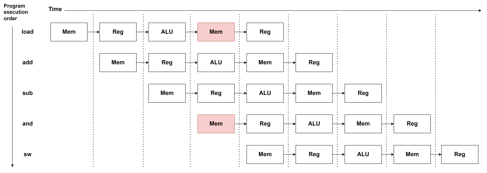
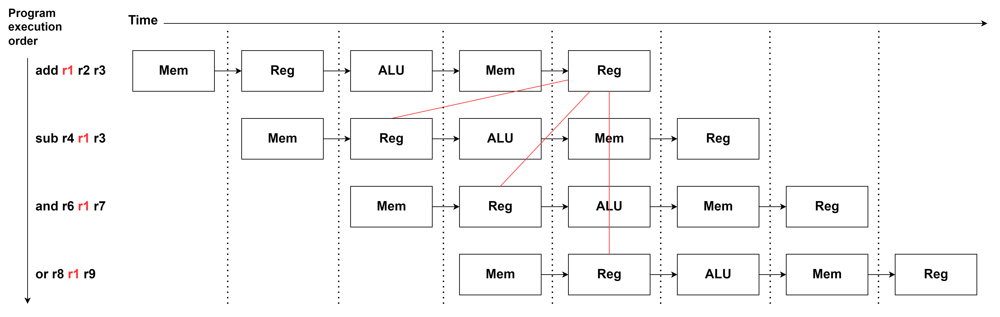
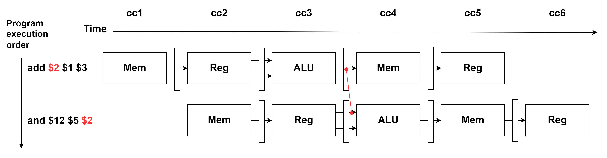
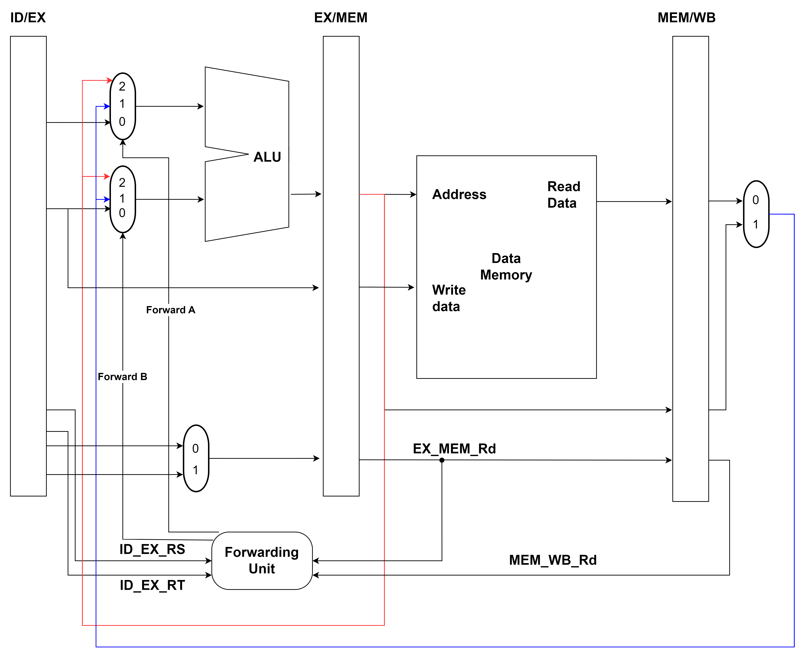
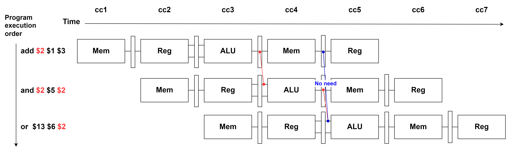
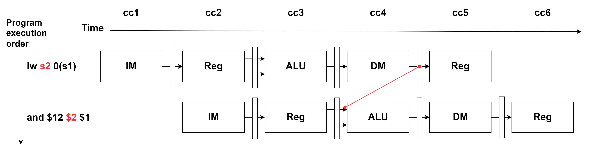
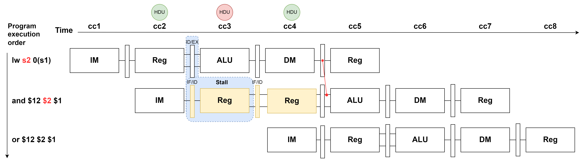
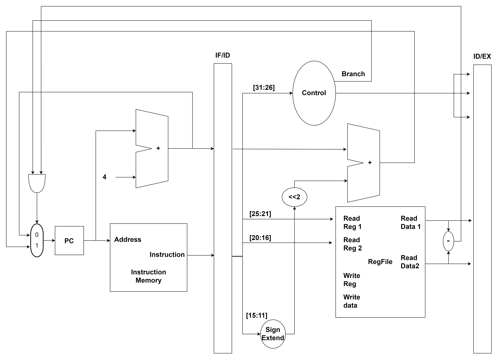

# MIPS-32bits CPU

## Table of Contents
- [MIPS-32bits CPU](#mips-32bits-cpu)
  - [Table of Contents](#table-of-contents)
  - [Description](#description)
  - [Basic Component](#basic-component)
  - [Hazard](#hazard)
    - [Structure Hazard](#structure-hazard)
    - [Data Hazard](#data-hazard)
      - [Software Solution](#software-solution)
      - [Hardware solution](#hardware-solution)
        - [Forwarding or Bypassing](#forwarding-or-bypassing)
        - [Stall](#stall)
    - [Control Hazard](#control-hazard)
      - [Early Branch](#early-branch)
  - [File Structure](#file-structure)
  - [Rivision history : v1.0](#rivision-history--v10)

***

## Description


Implement MIPS-32bits 5-Stage Pipeline CPU by Verilog. Deal with 3 types of data hazard:

- Structure Hazard
- Data Hazard
- Control Hazard


***
## Basic Component
- [Basic Component](./Component.md)
## Hazard

### Structure Hazard
System store and load the memory in the same time:

Solution:
Seperate a Memory to Instruction Memory and Data Memory.
### Data Hazard

#### Software Solution
1. Insert NOP(No Operation)
   Here `sub` and `and` have data hazard on `s2`:
   ```
   sub s2  s1 s3
   and s12 s2 s5
   ``` 
   
   Insert 2 `nop` between each others:

   ```
   sub s2  s1 s3
   nop
   nop
   and s12 s2 s5
   ```

   It's easy to implement, but not efficient. 
2. Pipeline scheduling or Instruction scheduling
   Here both `add` have data hazard with `lw` because of `s2` and `s4`:
   ```
   lw  s2 4(s0)
   add s3 s1 s2
   sub s6 s6 s7
   lw  s4 8(s0)
   add s5 s1 s4
   and s8 s8 s9
   ```

   Rearrange:
   ```
   lw  s2 4(s0)
   lw  s4 8(s0)
   sub s6 s6 s7
   add s3 s1 s2
   add s5 s1 s4
   and s8 s8 s9
   ```
   
   Now the distance between in `lw` and  `add` are greater than 2, problems solve!

#### Hardware solution

##### Forwarding or Bypassing
  In the Clock Cycle 4(cc4), ALU need to calculate `r12=r5&r2`, so that we need to  forward the alu Result(`r1+r3`) to `r2`.
  
  As the above figure, we can forward the result of ALU for next instruction's input of ALU:
  
  
  One Clock Cycle Hazards, EX & MEM
  ```
  if(EX_MEM_RegWrite) begin
    if((EX_MEM_rd != 0) && (EX_MEM_rd == ID_EX_rs))
        ForwardA = 2'b10;
    else if((EX_MEM_rd != 0) && (EX_MEM_rd == ID_EX_rt))
        ForwardB = 2'b10;
  ```
  Two Clock Cycle Hazards, EX & WB
  ```
  else if(MEM_WB_RegWrite) begin
    if((MEM_WB_rd != 0) && (MEM_WB_rd == ID_EX_rs))
        ForwardA = 2'b01; 
    else if((MEM_WB_rd != 0) && (MEM_WB_rd == ID_EX_rt))
        ForwardB = 2'b01;
  end
  ```

  `mem_alu_result` is Red Line in Figure, `reg_write_data` is Blue Line in Figure:
  ```
  assign ALU_input1 = (ForwardA==2'b10)? mem_alu_result:((ForwardA==2'b01)? reg_write_data: ex_ReadData_1);
  assign ALU_input2 = (ForwardB==2'b10)? mem_alu_result:((ForwardB==2'b01)? reg_write_data: read_data2);
  ```
  Assume value store in `$1` is `1`,  `$3` is `3`... and so on, no we can see the `Rd` `$2` have data dependency between `add` and `and`:
  ```
  // 00231020
  rom[0] = 32'b00000_00001_00011_00010_00000_100000; //add $2,  $1, $3
  // 00a26024 
  rom[1] = 32'b00000_00101_00010_01100_00000_100100; //and $12, $5, $2
  ```
  Now let's run the testbenches and print out the result in consule(hexadecimal). In time 40000, `add` is in `Mem Stage`, `and` is in `Exe Stage`, now EX_MEM_rd == ID_EX_rt, so `ForwardB` = `2'b10`. And we can see the `ALU_input2` in time 40000 is `00000004` that forwarded from `EXMEM_alu_result`:

  ```
  Time:   20000 | IFID_pc4: 00000000, IFID_inst: 00231020 ID_alu_op: 2, pc_next: 00000004: , branch_equal: 0 
  Time:   20000 | IDEX_pc4: xxxxxxxx, IDEX_ReadData1: 00000000, IDEX_ReadData2: 00000000, IDEX_SignExtend: 00000000, IDEX_inst25_21: 00,  IDEX_inst20_16: 00, IDEX_inst15_11: 00
  Time:   20000 | EX_alu_op: 10 , ALU_Ctrl: 2 ,  ForwardA: 0,  ForwardB: 0,  ALU_input1:00000000 , ALU_input2: 00000000
  Time:   20000 | EXMEM_PC_beq: 0000000X,EXMEM_alu_result: 00000000, EXMEM_ReadData2: 00000000, EXMEM_WriteRegister: 00
  Time:   20000 | MEMWB_ReadData: 00000000, MEMWB_alu_result: 00000000, MEMWB_WriteRegister: 00
  --------------------
  Time:   30000 | IFID_pc4: 00000004, IFID_inst: 00a26024 ID_alu_op: 2, pc_next: 00000008: , branch_equal: 0 
  Time:   30000 | IDEX_pc4: 00000000, IDEX_ReadData1: 00000001, IDEX_ReadData2: 00000003, IDEX_SignExtend: 00001020, IDEX_inst25_21: 01,  IDEX_inst20_16: 03, IDEX_inst15_11: 02
  Time:   30000 | EX_alu_op: 10 , ALU_Ctrl: 2 ,  ForwardA: 0,  ForwardB: 0,  ALU_input1:00000001 , ALU_input2: 00000003
  Time:   30000 | EXMEM_PC_beq: 00000000,EXMEM_alu_result: 00000000, EXMEM_ReadData2: 00000000, EXMEM_WriteRegister: 00
  Time:   30000 | MEMWB_ReadData: 00000000, MEMWB_alu_result: 00000000, MEMWB_WriteRegister: 00
  --------------------
  Time:   40000 | IFID_pc4: 00000008, IFID_inst: xxxxxxxx ID_alu_op: 2, pc_next: 0000000c: , branch_equal: 0 
  Time:   40000 | IDEX_pc4: 00000004, IDEX_ReadData1: 00000005, IDEX_ReadData2: 00000002, IDEX_SignExtend: 00006024, IDEX_inst25_21: 05,  IDEX_inst20_16: 02, IDEX_inst15_11: 0c
  Time:   40000 | EX_alu_op: 10 , ALU_Ctrl: 0 ,  ForwardA: 0,  ForwardB: 2,  ALU_input1:00000005 , ALU_input2: 00000004
  Time:   40000 | EXMEM_PC_beq: 00000000,EXMEM_alu_result: 00000004, EXMEM_ReadData2: 00000003, EXMEM_WriteRegister: 02
  Time:   40000 | MEMWB_ReadData: 00000000, MEMWB_alu_result: 00000000, MEMWB_WriteRegister: 00
  ``` 

  Let's try 2 clock cycle forwarding, assumed that each register's value are equal to index(ex. `$2`=2, `$3`=3) by defaults:
  ```
  rom[0] = 32'b00000_00001_00011_00010_00000_100000; //add $2,  $1, $3
  rom[1] = 32'b00000_00101_00100_01100_00000_100100; //and $12, $5, $4
  rom[2] = 32'b00000_00010_00110_01101_00000_100101; //or  $13, $2, $6
  ```
  In the time 50000, due to `MEM_WB_rd == ID_EX_rs` on `$2`, the `ForwardA` was set to 1 that `ALU_input1` can get the result from `EXMEM_alu_result`.
  ```
  Time:   20000 | fu_mem_RegWrite: 0, fu_wb_RegWrite: 0
  Time:   20000 | IFID_pc4: 00000000, IFID_inst: 00231020 ID_alu_op: 2, pc_next: 00000004: , branch_equal: 0, stall: 0,  IFID_WriteData: 00000000, ID_ mem_read: 0
  Time:   20000 | IDEX_inst:00000000, IDEX_pc4: xxxxxxxx, IDEX_ReadData1: 00000000, IDEX_ReadData2: 00000000, IDEX_SignExtend: 00000000, ex_MemRead: 0, 
  Time:   20000 | EX_alu_op: 2 , ALU_Ctrl: 2 ,  ForwardA: 0,  ForwardB: 0,  ALU_input1:00000000 , ALU_input2: 00000000
  Time:   20000 | mem_instr: 00000000 ,EXMEM_PC_beq: 0000000X,EXMEM_alu_result: 00000000, EXMEM_ReadData2: 00000000, EXMEM_WriteRegister: 00
  Time:   20000 | wb_instr: 00000000 ,MEMWB_ReadData: 00000000, MEMWB_alu_result: 00000000, MEMWB_WriteRegister: 00
  --------------------
  Time:   30000 | fu_mem_RegWrite: 1, fu_wb_RegWrite: 0
  Time:   30000 | IFID_pc4: 00000004, IFID_inst: 00a46024 ID_alu_op: 2, pc_next: 00000008: , branch_equal: 0, stall: 0,  IFID_WriteData: 00000000, ID_ mem_read: 0
  Time:   30000 | IDEX_inst:00231020, IDEX_pc4: 00000000, IDEX_ReadData1: 00000001, IDEX_ReadData2: 00000003, IDEX_SignExtend: 00001020, ex_MemRead: 0, 
  Time:   30000 | EX_alu_op: 2 , ALU_Ctrl: 2 ,  ForwardA: 0,  ForwardB: 0,  ALU_input1:00000001 , ALU_input2: 00000003
  Time:   30000 | mem_instr: 00000000 ,EXMEM_PC_beq: 00000000,EXMEM_alu_result: 00000000, EXMEM_ReadData2: 00000000, EXMEM_WriteRegister: 00
  Time:   30000 | wb_instr: 00000000 ,MEMWB_ReadData: 00000000, MEMWB_alu_result: 00000000, MEMWB_WriteRegister: 00
  --------------------
  Time:   40000 | fu_mem_RegWrite: 1, fu_wb_RegWrite: 1
  Time:   40000 | IFID_pc4: 00000008, IFID_inst: 00466825 ID_alu_op: 2, pc_next: 0000000c: , branch_equal: 0, stall: 0,  IFID_WriteData: 00000000, ID_ mem_read: 0
  Time:   40000 | IDEX_inst:00a46024, IDEX_pc4: 00000004, IDEX_ReadData1: 00000005, IDEX_ReadData2: 00000004, IDEX_SignExtend: 00006024, ex_MemRead: 0, 
  Time:   40000 | EX_alu_op: 2 , ALU_Ctrl: 0 ,  ForwardA: 0,  ForwardB: 0,  ALU_input1:00000005 , ALU_input2: 00000004
  Time:   40000 | mem_instr: 00231020 ,EXMEM_PC_beq: 00000000,EXMEM_alu_result: 00000004, EXMEM_ReadData2: 00000003, EXMEM_WriteRegister: 02
  Time:   40000 | wb_instr: 00000000 ,MEMWB_ReadData: 00000000, MEMWB_alu_result: 00000000, MEMWB_WriteRegister: 00
  --------------------
  Time:   50000 | fu_mem_RegWrite: 1, fu_wb_RegWrite: 1
  Time:   50000 | IFID_pc4: 0000000c, IFID_inst: xxxxxxxx ID_alu_op: 2, pc_next: 00000010: , branch_equal: 0, stall: 0,  IFID_WriteData: 00000004, ID_ mem_read: 0
  Time:   50000 | IDEX_inst:00466825, IDEX_pc4: 00000008, IDEX_ReadData1: 00000002, IDEX_ReadData2: 00000006, IDEX_SignExtend: 00006825, ex_MemRead: 0, 
  Time:   50000 | EX_alu_op: 2 , ALU_Ctrl: 1 ,  ForwardA: 1,  ForwardB: 0,  ALU_input1:00000004 , ALU_input2: 00000006
  Time:   50000 | mem_instr: 00a46024 ,EXMEM_PC_beq: 00000000,EXMEM_alu_result: 00000004, EXMEM_ReadData2: 00000004, EXMEM_WriteRegister: 0c
  Time:   50000 | wb_instr: 00231020 ,MEMWB_ReadData: 00000000, MEMWB_alu_result: 00000004, MEMWB_WriteRegister: 02
  ```
  Let's consider another situation, if three consequent instruction have data dependency, they all read/write in same register `$2`:
  
  
  
  Before we set 2 clock cycle forwarding (MEM/WB to ALU), we need to check if there's already 1 clock forwarding by `ForwardA == 2'b00` or `ForwardB == 2'b00`.
  ```
  else if(MEM_WB_RegWrite) begin
    if((MEM_WB_rd != 0) && (MEM_WB_rd == ID_EX_rs) && (ForwardA == 2'b00))
        ForwardA = 2'b01; 
    else if((MEM_WB_rd != 0) && (MEM_WB_rd == ID_EX_rt) && (ForwardB == 2'b00))
        ForwardB = 2'b01;
  end
  ``` 

  Let's try the instruction in testbench:
  ```
  rom[0] = 32'b00000_00001_00011_00010_00000_100000; //add $2,  $1, $3
  rom[1] = 32'b00000_00101_00010_00010_00000_100100; //and $2,  $5, $2
  rom[2] = 32'b00000_00110_00010_01101_00000_100101; //or  $13, $6, $2
  ```
  
  For this situation
  In Time 50000, we can see both `ForwardA` and `ForwardB` are `2` because in time 40000 already forward. The first ALU stage should be `$2 = 1+3`, so we expect second ALU stage be `$2 = 5&4` and third be `$2 = 6|4`.
  In time 40000,  `ForwardB` are `2` , `ALU_input1:` , `ALU_input2: 4`.
  In time 50000,  `ForwardB` are `2` , `ALU_input1:` , `ALU_input2: 4`.
  
  ```
  Time:   20000 | fu_mem_RegWrite: 0, fu_wb_RegWrite: 0
  Time:   20000 | IFID_pc4: 00000000, IFID_inst: 00231020 ID_alu_op: 2, pc_next: 00000004: , branch_equal: 0, stall: 0,  IFID_WriteData: 00000000, ID_ mem_read: 0
  Time:   20000 | IDEX_inst:00000000, IDEX_pc4: xxxxxxxx, IDEX_ReadData1: 00000000, IDEX_ReadData2: 00000000, IDEX_SignExtend: 00000000, ex_MemRead: 0, 
  Time:   20000 | EX_alu_op: 2 , ALU_Ctrl: 2 ,  ForwardA: 0,  ForwardB: 0,  ALU_input1:00000000 , ALU_input2: 00000000
  Time:   20000 | mem_instr: 00000000 ,EXMEM_PC_beq: 0000000X,EXMEM_alu_result: 00000000, EXMEM_ReadData2: 00000000, EXMEM_WriteRegister: 00
  Time:   20000 | wb_instr: 00000000 ,MEMWB_ReadData: 00000000, MEMWB_alu_result: 00000000, MEMWB_WriteRegister: 00
  --------------------
  Time:   30000 | fu_mem_RegWrite: 1, fu_wb_RegWrite: 0
  Time:   30000 | IFID_pc4: 00000004, IFID_inst: 00a21024 ID_alu_op: 2, pc_next: 00000008: , branch_equal: 0, stall: 0,  IFID_WriteData: 00000000, ID_ mem_read: 0
  Time:   30000 | IDEX_inst:00231020, IDEX_pc4: 00000000, IDEX_ReadData1: 00000001, IDEX_ReadData2: 00000003, IDEX_SignExtend: 00001020, ex_MemRead: 0, 
  Time:   30000 | EX_alu_op: 2 , ALU_Ctrl: 2 ,  ForwardA: 0,  ForwardB: 0,  ALU_input1:00000001 , ALU_input2: 00000003
  Time:   30000 | mem_instr: 00000000 ,EXMEM_PC_beq: 00000000,EXMEM_alu_result: 00000000, EXMEM_ReadData2: 00000000, EXMEM_WriteRegister: 00
  Time:   30000 | wb_instr: 00000000 ,MEMWB_ReadData: 00000000, MEMWB_alu_result: 00000000, MEMWB_WriteRegister: 00
  --------------------
  Time:   40000 | fu_mem_RegWrite: 1, fu_wb_RegWrite: 1
  Time:   40000 | IFID_pc4: 00000008, IFID_inst: 00c26825 ID_alu_op: 2, pc_next: 0000000c: , branch_equal: 0, stall: 0,  IFID_WriteData: 00000000, ID_ mem_read: 0
  Time:   40000 | IDEX_inst:00a21024, IDEX_pc4: 00000004, IDEX_ReadData1: 00000005, IDEX_ReadData2: 00000002, IDEX_SignExtend: 00001024, ex_MemRead: 0, 
  Time:   40000 | EX_alu_op: 2 , ALU_Ctrl: 0 ,  ForwardA: 0,  ForwardB: 2,  ALU_input1:00000005 , ALU_input2: 00000004
  Time:   40000 | mem_instr: 00231020 ,EXMEM_PC_beq: 00000000,EXMEM_alu_result: 00000004, EXMEM_ReadData2: 00000003, EXMEM_WriteRegister: 02
  Time:   40000 | wb_instr: 00000000 ,MEMWB_ReadData: 00000000, MEMWB_alu_result: 00000000, MEMWB_WriteRegister: 00
  --------------------
  Time:   50000 | fu_mem_RegWrite: 1, fu_wb_RegWrite: 1
  Time:   50000 | IFID_pc4: 0000000c, IFID_inst: xxxxxxxx ID_alu_op: 2, pc_next: 00000010: , branch_equal: 0, stall: 0,  IFID_WriteData: 00000004, ID_ mem_read: 0
  Time:   50000 | IDEX_inst:00c26825, IDEX_pc4: 00000008, IDEX_ReadData1: 00000006, IDEX_ReadData2: 00000002, IDEX_SignExtend: 00006825, ex_MemRead: 0, 
  Time:   50000 | EX_alu_op: 2 , ALU_Ctrl: 1 ,  ForwardA: 0,  ForwardB: 2,  ALU_input1:00000006 , ALU_input2: 00000004
  Time:   50000 | mem_instr: 00a21024 ,EXMEM_PC_beq: 00000000,EXMEM_alu_result: 00000004, EXMEM_ReadData2: 00000002, EXMEM_WriteRegister: 02
  Time:   50000 | wb_instr: 00231020 ,MEMWB_ReadData: 00000000, MEMWB_alu_result: 00000004, MEMWB_WriteRegister: 02
  ```
##### Stall
  There's a situation that forwarding can't fix it : the instruction follow behind `load` using same register, so called "load-used data hazard".
  

  Now we need a "Hazard Detect Unit" to detect the hazrd and staall the `PC` , `IF/ID` and `ID/EX` Pipeline, make sure in cc5 ALU can get the correct result.
  
  

  In above example, there's hazard between `lw` and `and` on `$2`, so we need to make sure when `lw` instruction in `EX` stage, if next instruction's `rs` or `rt ` are `lw` instruction's `rt`, than will trigger the `stall`.

  ```
  module Hazard_Detection_Unit(
    input clk, reset, 
    input IDEX_MemRead,
    input [4:0] IFID_Rs, IFID_Rt, IDEX_Rt, 
    output reg stall
    );
    
    always@(*) begin
        if(IDEX_MemRead && (IDEX_Rt==IFID_Rs || IDEX_Rt==IFID_Rt))
            stall = 1;
        else
            stall = 0;
    end
  endmodule
  ```
  If `stall` be trigger, `PC` and  `IFID` should stall for a clock cycle:
  ```
  always@(posedge clk or posedge reset) begin
        if(reset) instr_o <= 0;
        else if (stall);
        else begin
            pc4_o   <= pc4_i;
            instr_o <= instr_i;
        end
  end
  ```
  Don't forget the forwarding pass:
  ```
  if(MEMWB_OPcode ==  6'b100011) begin
      if((MEM_WB_rt != 0) && (MEM_WB_rt == ID_EX_rs) && (ForwardA == 2'b00))
          ForwardA = 2'b11;
      else if((MEM_WB_rt != 0) && (MEM_WB_rt == ID_EX_rt) && (ForwardB == 2'b00))
          ForwardB = 2'b11; 
  end
  ```
  Have this new forwarding pass `2'b11`, we can connect data read from Data Memory to  ALU input:

  ```
  assign ALU_input1 = (ForwardA==2'b11)? wb_ReadData:(ForwardA==2'b10)? mem_alu_result:((ForwardA==2'b01)? reg_write_data: ex_ReadData_1);
  assign ALU_input2 = (ForwardB==2'b11)? wb_ReadData:(ForwardB==2'b10)? mem_alu_result:((ForwardB==2'b01)? reg_write_data: read_data2);
  ```
  Let's try some instructions that will case the load-used, assumed that data in `$1` is 1, `$2` is 2 by defaults:
  ```
  rom[0] = 32'b100011_00001_00010_0000000000000000;   // lw  $2  0  $1 (8c220000) 
  rom[1] = 32'b000000_00010_00001_01100_00000_100100; // and $12 $2 $1 (00416024)
  rom[2] = 32'b000000_00010_00001_01100_00000_100101; // or  $12 $2 $1 (00416025)
  ```
  Notice that in time 30000 , when `lw` instruction in `IDEX` stage that `stall` was triggered because `IDEX_Rt==IFID_Rs`.
  In time 40000, except `PC` and `IFID` stage was stall for one clock, the others stage are keep going.
  In time 50000, `ForwardA: 3` because `MEM_WB_rt == ID_EX_rs`, we can see `MEMWB_ReadData` was forwarded to `ALU_input1`. Original `$12 $2 $1` was `$12 = 2 & 1`, after `stall` and `forwarding` become `$12 = 1 & 1`.
  ```
  Time:   20000 | fu_mem_RegWrite: 0, fu_wb_RegWrite: 0
  Time:   20000 | IFID_pc4: 00000000, IFID_inst: 8c220000 ID_alu_op: 0, pc_next: 00000004: , branch_equal: 0, stall: 0,  IFID_WriteData: 00000000, ID_ mem_read: 1
  Time:   20000 | IDEX_inst:00000000, IDEX_pc4: xxxxxxxx, IDEX_ReadData1: 00000000, IDEX_ReadData2: 00000000, IDEX_SignExtend: 00000000, ex_MemRead: 0, 
  Time:   20000 | EX_alu_op: 2 , ALU_Ctrl: 2 ,  ForwardA: 0,  ForwardB: 0,  ALU_input1:00000000 , ALU_input2: 00000000
  Time:   20000 | mem_instr: 00000000 ,EXMEM_PC_beq: 0000000X,EXMEM_alu_result: 00000000, EXMEM_ReadData2: 00000000, EXMEM_WriteRegister: 00
  Time:   20000 | wb_instr: 00000000 ,MEMWB_ReadData: 00000000, MEMWB_alu_result: 00000000, MEMWB_WriteRegister: 00
  --------------------
  Time:   30000 | fu_mem_RegWrite: 1, fu_wb_RegWrite: 0
  Time:   30000 | IFID_pc4: 00000004, IFID_inst: 00416024 ID_alu_op: 2, pc_next: 00000008: , branch_equal: 0, stall: 1,  IFID_WriteData: 00000000, ID_ mem_read: 0
  Time:   30000 | IDEX_inst:8c220000, IDEX_pc4: 00000000, IDEX_ReadData1: 00000001, IDEX_ReadData2: 00000002, IDEX_SignExtend: 00000000, ex_MemRead: 1, 
  Time:   30000 | EX_alu_op: 0 , ALU_Ctrl: 2 ,  ForwardA: 0,  ForwardB: 0,  ALU_input1:00000001 , ALU_input2: 00000000
  Time:   30000 | mem_instr: 00000000 ,EXMEM_PC_beq: 00000000,EXMEM_alu_result: 00000000, EXMEM_ReadData2: 00000000, EXMEM_WriteRegister: 00
  Time:   30000 | wb_instr: 00000000 ,MEMWB_ReadData: 00000000, MEMWB_alu_result: 00000000, MEMWB_WriteRegister: 00
  --------------------
  Time:   40000 | fu_mem_RegWrite: 1, fu_wb_RegWrite: 1
  Time:   40000 | IFID_pc4: 00000004, IFID_inst: 00416024 ID_alu_op: 2, pc_next: 00000008: , branch_equal: 0, stall: 0,  IFID_WriteData: 00000000, ID_ mem_read: 0
  Time:   40000 | IDEX_inst:00416024, IDEX_pc4: 00000004, IDEX_ReadData1: 00000002, IDEX_ReadData2: 00000001, IDEX_SignExtend: 00006024, ex_MemRead: 0, 
  Time:   40000 | EX_alu_op: 2 , ALU_Ctrl: 0 ,  ForwardA: 0,  ForwardB: 0,  ALU_input1:00000002 , ALU_input2: 00000001
  Time:   40000 | mem_instr: 8c220000 ,EXMEM_PC_beq: 00000000,EXMEM_alu_result: 00000001, EXMEM_ReadData2: 00000002, EXMEM_WriteRegister: 02
  Time:   40000 | wb_instr: 00000000 ,MEMWB_ReadData: 00000000, MEMWB_alu_result: 00000000, MEMWB_WriteRegister: 00
  --------------------
  Time:   50000 | fu_mem_RegWrite: 1, fu_wb_RegWrite: 1
  Time:   50000 | IFID_pc4: 00000008, IFID_inst: 00416025 ID_alu_op: 2, pc_next: 0000000c: , branch_equal: 0, stall: 0,  IFID_WriteData: 00000001, ID_ mem_read: 0
  Time:   50000 | IDEX_inst:00416024, IDEX_pc4: 00000004, IDEX_ReadData1: 00000002, IDEX_ReadData2: 00000001, IDEX_SignExtend: 00006024, ex_MemRead: 0, 
  Time:   50000 | EX_alu_op: 2 , ALU_Ctrl: 0 ,  ForwardA: 3,  ForwardB: 0,  ALU_input1:00000001 , ALU_input2: 00000001
  Time:   50000 | mem_instr: 00416024 ,EXMEM_PC_beq: 00000000,EXMEM_alu_result: 00000000, EXMEM_ReadData2: 00000001, EXMEM_WriteRegister: 0c
  Time:   50000 | wb_instr: 8c220000 ,MEMWB_ReadData: 00000001, MEMWB_alu_result: 00000001, MEMWB_WriteRegister: 02
  ```
### Control Hazard
The error instruction between branch start and branch target.
#### Early Branch
We can use xor and nor to compete the two registers in `ID` stage, than if branch equal, we only need to discard the value of `IF/ID` pipe.


Let's try the following `branch` instruction:
```
rom[0] = 32'b000100_00000_00000_0000000000000010;  //beq $0  $0 2
rom[1] = 32'b00000_00101_00001_00011_00000_100100; //and $3  $5 $1
rom[2] = 32'b00000_00110_00011_01101_00000_100101; //or  $13 $6 $3
rom[3] = 32'b00000_00111_00011_01101_00000_100010; //sub $13 $7 $3
```
When time 20000 `beq` in `ID` stage and `branch_equal` are positive, system flush the data in `IF/ID` pipe and `pc_next` are set to `0000000c` that `pc+4` + `Immed*4` ((0+4) + 8).
At time 30000, `IF/ID`, we can see the `IFID_inst` are `00000000` and time 40000 both `ALU_input` are `0`.
`sub ` in `EX` stage when time 50000,  `ALU_input` are `7` adn `3` that what we expect!
```
Time:   20000 | fu_mem_RegWrite: 0, fu_wb_RegWrite: 0
Time:   20000 | IFID_pc4: 00000004, IFID_inst: 10000002 ID_alu_op: 1, pc_next: 0000000c: , branch_equal: 1, stall: 0,  IFID_WriteData: 00000000, ID_ mem_read: 0
Time:   20000 | IDEX_inst:00000000, IDEX_pc4: xxxxxxxx, IDEX_ReadData1: 00000000, IDEX_ReadData2: 00000000, IDEX_SignExtend: 00000000, ex_MemRead: 0, 
Time:   20000 | EX_alu_op: 2 , ALU_Ctrl: 2 ,  ForwardA: 0,  ForwardB: 0,  ALU_input1:00000000 , ALU_input2: 00000000
Time:   20000 | mem_instr: 00000000 ,EXMEM_PC_beq: 0000000X,EXMEM_alu_result: 00000000, EXMEM_ReadData2: 00000000, EXMEM_WriteRegister: 00
Time:   20000 | wb_instr: 00000000 ,MEMWB_ReadData: 00000000, MEMWB_alu_result: 00000000, MEMWB_WriteRegister: 00
--------------------
Time:   30000 | fu_mem_RegWrite: 1, fu_wb_RegWrite: 0
Time:   30000 | IFID_pc4: 00000004, IFID_inst: 00000000 ID_alu_op: 2, pc_next: 00000010: , branch_equal: 0, stall: 0,  IFID_WriteData: 00000000, ID_ mem_read: 0
Time:   30000 | IDEX_inst:10000002, IDEX_pc4: 00000004, IDEX_ReadData1: 00000000, IDEX_ReadData2: 00000000, IDEX_SignExtend: 00000002, ex_MemRead: 0, 
Time:   30000 | EX_alu_op: 1 , ALU_Ctrl: 6 ,  ForwardA: 0,  ForwardB: 0,  ALU_input1:00000000 , ALU_input2: 00000000
Time:   30000 | mem_instr: 00000000 ,EXMEM_PC_beq: 00000000,EXMEM_alu_result: 00000000, EXMEM_ReadData2: 00000000, EXMEM_WriteRegister: 00
Time:   30000 | wb_instr: 00000000 ,MEMWB_ReadData: 00000000, MEMWB_alu_result: 00000000, MEMWB_WriteRegister: 00
--------------------
Time:   40000 | fu_mem_RegWrite: 0, fu_wb_RegWrite: 1
Time:   40000 | IFID_pc4: 00000010, IFID_inst: 00e36822 ID_alu_op: 2, pc_next: 00000014: , branch_equal: 0, stall: 0,  IFID_WriteData: 00000000, ID_ mem_read: 0
Time:   40000 | IDEX_inst:00000000, IDEX_pc4: 00000004, IDEX_ReadData1: 00000000, IDEX_ReadData2: 00000000, IDEX_SignExtend: 00000000, ex_MemRead: 0, 
Time:   40000 | EX_alu_op: 2 , ALU_Ctrl: 2 ,  ForwardA: 0,  ForwardB: 0,  ALU_input1:00000000 , ALU_input2: 00000000
Time:   40000 | mem_instr: 10000002 ,EXMEM_PC_beq: 00000000,EXMEM_alu_result: 00000000, EXMEM_ReadData2: 00000000, EXMEM_WriteRegister: 00
Time:   40000 | wb_instr: 00000000 ,MEMWB_ReadData: 00000000, MEMWB_alu_result: 00000000, MEMWB_WriteRegister: 00
--------------------
Time:   50000 | fu_mem_RegWrite: 1, fu_wb_RegWrite: 0
Time:   50000 | IFID_pc4: 00000014, IFID_inst: 01036820 ID_alu_op: 2, pc_next: 00000018: , branch_equal: 0, stall: 0,  IFID_WriteData: 00000000, ID_ mem_read: 0
Time:   50000 | IDEX_inst:00e36822, IDEX_pc4: 00000010, IDEX_ReadData1: 00000007, IDEX_ReadData2: 00000003, IDEX_SignExtend: 00006822, ex_MemRead: 0, 
Time:   50000 | EX_alu_op: 2 , ALU_Ctrl: 6 ,  ForwardA: 0,  ForwardB: 0,  ALU_input1:00000007 , ALU_input2: 00000003
Time:   50000 | mem_instr: 00000000 ,EXMEM_PC_beq: 00000000,EXMEM_alu_result: 00000000, EXMEM_ReadData2: 00000000, EXMEM_WriteRegister: 00
Time:   50000 | wb_instr: 10000002 ,MEMWB_ReadData: 00000000, MEMWB_alu_result: 00000000, MEMWB_WriteRegister: 00
```
<!-- #### Dynamic Branch Prediction -->
  
## File Structure

```
mips32/
│
├── README.md
├── Component.md
│
├── pipeline/
│   ├── sim_1/
│   │   ├── tb_XOR_NOR.v
│   │   ├── tb_alu.v
│   │   ├── tb_aluctrl_jrctrl.v
│   │   ├── tb_controlUnit.v
│   │   ├── tb_data_memory.v
│   │   ├── tb_instr_mem.v
│   │   ├── tb_mips32.v
│   │   └── tb_registerfile.v
│   │
│   └── sources_1/
│       ├── IF_ID.v
│       ├── ID_EX.v
│       ├── EX_MEM.v
│       ├── MEM_WB.v
│       ├── Hazard_Detection_Unit.v
│       ├── Forwarding_Unit.v
│       ├── XOR_NOR.v
│       ├── ProgramCounter.v
│       ├── Add_Pc.v
│       ├── alu.v
│       ├── alucontrol.v
│       ├── control.v
│       ├── data_memory.v
│       ├── inst_memory.v
│       ├── mips_32.v
│       └── register_file.v
│
└── single_cycle/
│   ├── sim_1/
│   │   ├── tb_alu.v
│   │   ├── tb_aluctrl_jrctrl.v
│   │   ├── tb_controlUnit.v
│   │   ├── tb_data_memory.v
│   │   ├── tb_instr_mem.v
│   │   ├── tb_mips32.v
│   │   └── tb_registerfile.v
│   │
│   └── sources_1/
│       ├── alu.v
│       ├── alucontrol.v
│       ├── control.v
│       ├── data_memory.v
│       ├── inst_memory.v
│       ├── mips_32.v
│       └── register_file.v

```
## Rivision history : v1.0
